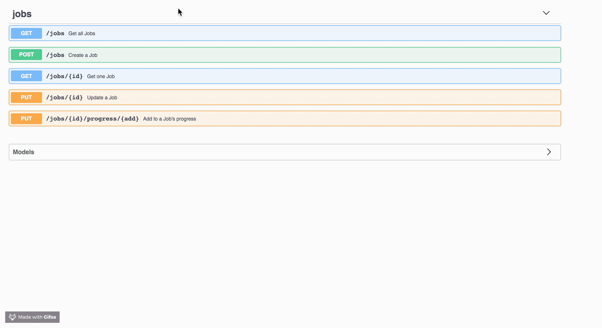

# Demo Application - Job Service API

This Job Service is an HTTP service for tracking progress of background jobs.



The job is represented by:

* `id` - unique job’s identifier
* `total` - a number representing total size of the job
* `progress` - a number representing current progress of the job (ie. job is considered completed when progress == total)

The service interface supports the following actions:

* Register a job - accept `total` attribute, generates and return an ID for the job.
* Update a job based on ID - allows incrementing job's `progress` by some arbitrary number or setting absolute `progress`. This supports a large volume of (potentially concurrent) update requests to the same job.
* Show all jobs
* Show individual job by ID

Additional features:

* Jobs expire after they have not been updated for 1 minute via a cron job.
* The job state is cached in memory.

## Dev Setup Requirements

* Java 8
* Docker
* IntelliJ recommended (run-configs provided)
* IntelliJ enable annotation processing (for Lombok)

## Local Development

Tests can be run with `./gradlew checkstyleMain checkstyleTest test`.

Spin up dependencies with:
```
docker-compose -f local-dev.yml up
```

The server can be started by using the IntelliJ run configuration `run-local`.

Navigate to http://localhost:8080/swagger.

## TODO:
* environment variables
* integration tests
* CI/CD
* metrics/monitoring
